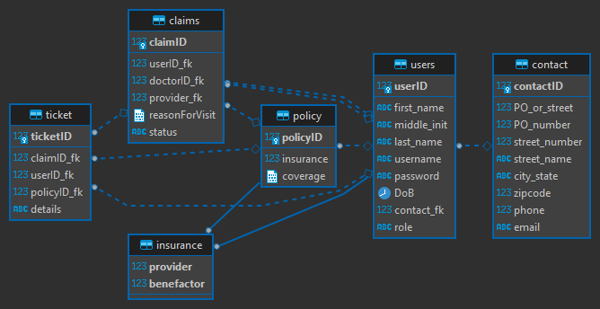

# ABOUT
As the health care insurance world becomes more complicted as various companies strive to confuse patient health billing, Easy Pickings LLC. strives to simplify the process with a stream-lined user interface to manage claims amongst various insurance companies and hospitals. We serve as an intermediary between all parties and where users have the independence to file and montitor their own claims. This will remove the strain on the hospitals to deal with the business side of these claims so they can focus on getting everyone back in working order.
# User Stories
- The user will need a way to register a new account
- The user will need a way to login with an existing account
- The user will be able to reset their password
- A user can either be a patient or employee of the insurance company
- A patient can file a claim
- A patient can view all their filed claims
- An employee can view all filed claims
- An employee can approve or deny a pending claim
# MVP Requirements
- Login
    - existing users can use the system
- Registration
    - new users can be added
- User roles
    - Can either be patient or employee
- Update contact information
    - A user should be able to update their address, phone-number, email, and full name if need be
- Reset password 
    - forgetful people can make a new password
- File claims
    - A patient can file a claim for insurance assistance
- Processing claims
    - An employee can either approve or deny a pending claim
# Stretch Goals 
- JWT Implementation
- Discussion boards
- COVAX Verification 
- Dark Mode
- Insurance card exportation
- Tech support Live Chat
- Ticketing system
- Scheduling tools
# Technology used
- C#
- ASP.NET Core
- SQL Server
- Azure Cloud Service
- Angular
- HTML
- CSS
- TypeScript
- Github Action
- Entity Framework Core
# Tables
- users
- insurance
- address
- claims

# Entity Relationship Diagram

